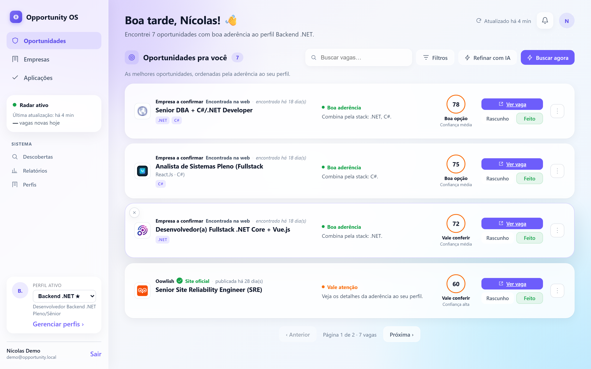
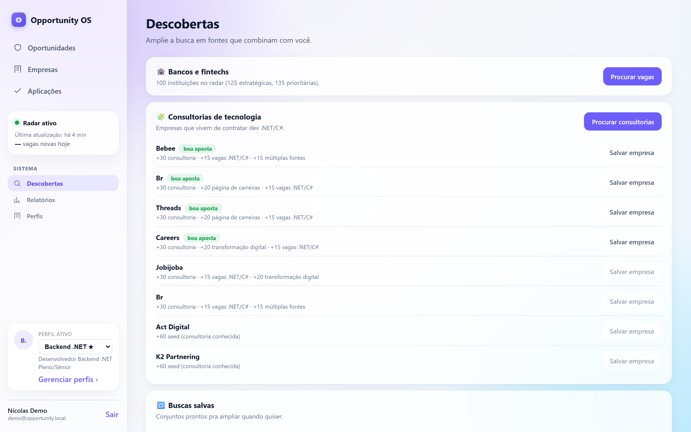
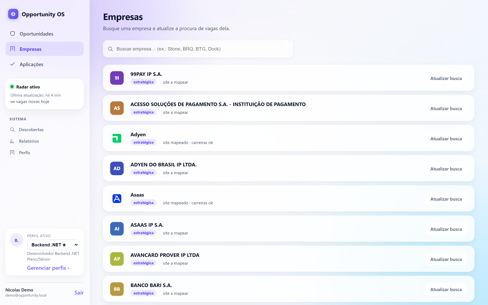

# Opportunity OS

**Um sistema operacional pessoal para oportunidades profissionais.**
Descobre vagas globalmente, pontua cada uma contra o seu perfil e monta um radar único, revisável, humano.

Não é um bot de aplicar em vaga. Não faz scraping logado no LinkedIn. É um copiloto de carreira.



---

## O que ele faz

- **Descoberta contínua** — crawler de páginas de careers + integração nativa com Greenhouse, Lever, Ashby, SmartRecruiters e Gupy. Fallback em busca web (Serper/Google CSE) quando a empresa não tem ATS público.
- **Pontuação híbrida por perfil** — motor determinístico (skills, senioridade, região, contrato) combinado com **embeddings semânticos** e, opcionalmente, **LLM-as-judge** re-rankeando o topo do feed. Cada score é explicável: "Combina pela stack: .NET, C#".
- **Multi-perfil** — mesmo motor serve Backend .NET, Java Backend, Frontend React, Data Engineer. Serve pra validar que a arquitetura generaliza antes de virar produto.
- **Radar em tela única** — última execução, novas hoje, top-N ordenado por aderência, feedback direto ("não serve — dizer por quê"). Sem 12 abas.
- **Digest diário por e-mail** com as vagas do dia, sempre revisáveis.
- **Provedores de LLM plugáveis** — Groq (free tier), OpenAI, Anthropic, Ollama local. Troca por config, sem alterar código.

## Stack

- **.NET 10 + ASP.NET Core** Minimal API · **Hangfire** para jobs recorrentes
- **PostgreSQL 18** + **EF Core 10** (listas em `jsonb`)
- **React 18 + Vite + TypeScript** no frontend
- **Docker Compose** para o ambiente inteiro
- **xUnit** para testes unitários e de integração
- **Clean Architecture** (Domain → Application → Infrastructure → Api)

## Rodar local

```bash
docker compose up -d postgres
dotnet run --project src/OpportunityOS.Api    # sobe API + aplica migrations + seed
cd frontend && npm install && npm run dev     # http://localhost:5173
```

No Windows tem um one-liner: `dev-up` (sobe Postgres + API + Worker + Frontend em janelas separadas).

Detalhes completos de arquitetura, endpoints, providers e roadmap em [docs/ARCHITECTURE.md](docs/ARCHITECTURE.md).

## Screenshots

| Radar de oportunidades | Descobertas (bancos, fintechs, consultorias) | Empresas no radar |
|---|---|---|
|  |  |  |

## Status

Fase atual: **multi-perfil pré-auth-multi-tenant**. Já tem login por usuário; próximos passos são workspaces reais e onboarding público.

## Autor

[Nícolas Serrano](https://github.com/NicsDeveloper) — Backend Engineer, .NET/C#. Construído em público como estudo de arquitetura + IA aplicada.
